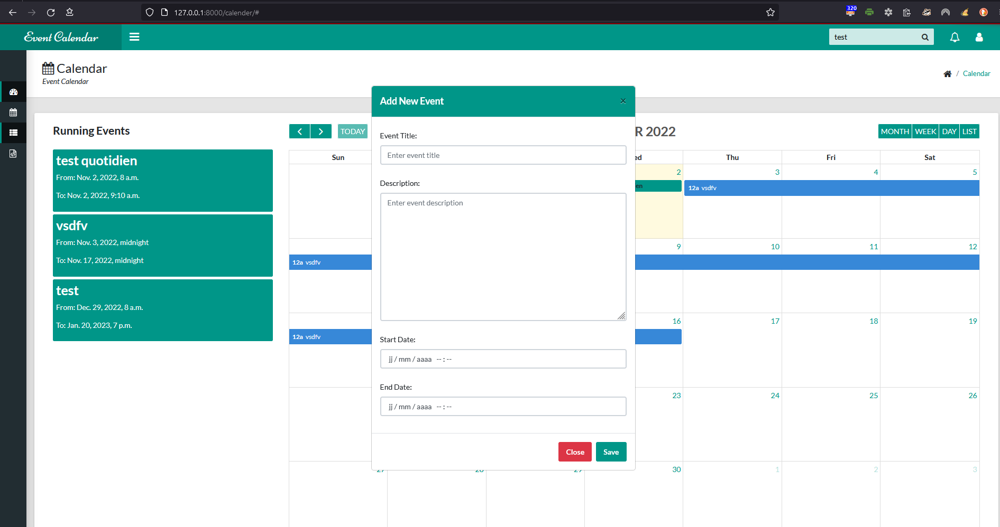

# Event Calendar in Django


# Screenshot




## How To Setup
```
git clone https://github.com/dev-KC20/kp-wwaw-agenda.git
```
```
git checkout try-sajib
cd try-sajib
cd event-calendar   
```
```
python3 -m venv ENV
```
```
ENV\Scripts\activate
```
```
pip install -r requirements.txt
```
```
python manage.py makemigrations
```
```
python manage.py migrate
```
```
python manage.py createsuperuser
```

To later use the Agenda:
```
python manage.py runserver
# for the user Front-end
open your webbrowser 127.0.0.1:8000 
# for the superuser admin site
open your webbrowser 127.0.0.1:8000/admin 
# and log in with your just created supperuser credentials
```
